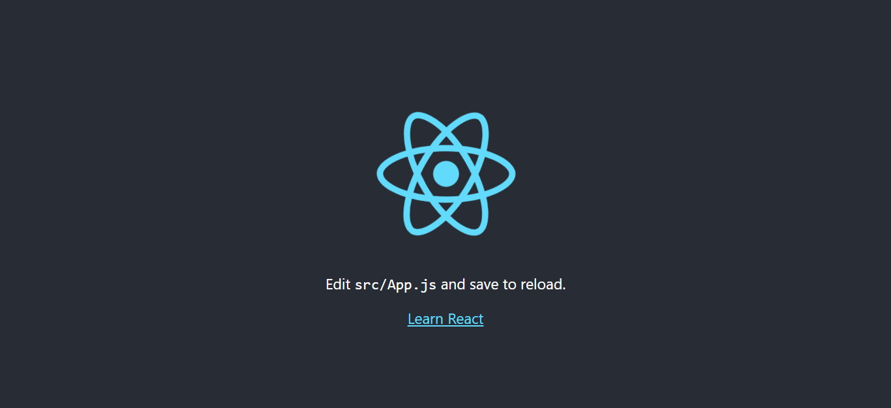

# REACT.JS

## What is React.js?

React.js is an open-source JavaScript library created by Facebook in 2011, aiming to simplify the intricate process of building interactive UIs.

### History:

Back in 2011, Facebook wanted to offer a richer user experience through a more dynamic and more responsive user interface that was fast and highly performant.

Jordan Walke, one of Facebook's software engineers, solved this problem by creating **React**. It simplified the development process by offering a more systematic approach to creating dynamic and interactive user interfaces through reusable components.

### Features:

- **One-way Data Binding** - In React, data flows in a single direction: from parent components to child components. This means that the properties (props) in a child component cannot send data back to its parent component. However, child components can communicate with parent components to alter states based on the inputs they receive.
- **Optimized Performance** - React uses virtual DOM and updates only the modified parts, making the DOM run faster. It is well-suited for large-scale projects.
- **Extensions** - React offers a variety of extensions that enable the development of comprehensive UI applications. It not only supports mobile app development but also provides server-side rendering. Extensions like Flux, Redux, and React Native enhance React's capabilities, allowing for the creation of attractive and functional user interfaces.
- **Component-Based** - React.js divides the web page into multiple components as it is component-based. Each component is a part of the UI design and has its own logic and design.
- **Simplicity** - Due to the component-based and reusable system of React, it makes code easy to understand, debug, and has less code.

## How to Install React.js?

### Step 1: Install NodeJS
- Download the current version of Node.js [here.](https://nodejs.org/en/download/prebuilt-installer/current)
- Install and just click the **Next** until it is finished.

### Step 2: Verify NodeJS Installation
- Open command prompt and run this in the terminal:
```bash
node -v
```
- The prompt shall display the version you installed.

### Step 3: Install the CRA package

- Again, in the terminal, run the following command to install create-react-app:
```bash
npm install -g create-react-app
```
- To verify if the installation went well, run the following command:
```bash
create-react-app --version
```
- The prompt shall display the version you installed.

### Step 4: Create Directory for React Projects

- Create a new folder where you will make your react app through this command:
```bash
mkdir newfolder
``` 
  **Note:** The *newfolder* is the name of the folder, you can change it.
- Move into the folder you created through this command:
```bash
cd newfolder
```

### Step 5: Create the React App

- Inside the created folder, run the following command and wait for the installation to finish:
```bash
npx create-react-app reactfirst
```
  <span style="background-color: #000000">**Note:** The app's name must be created using <ins>lowercase letters</ins> only due to npm naming restrictions.</span>

### Step 6: Open the Project in a Code Editor

- Open the project folder in your chosen IDE. [Visual Studio Code](https://code.visualstudio.com/) is highly recommended.
- Inside the *newfolder*(example), you will see your app's name *reactfirst*(example). Use the terminal to move inside your app using this command:
```bash
cd reactfirst
```

### Step 7: Run the App!

- Run the following command to start your app:
```bash
npm start
```
- A new tab shall open in your browser showing the React logo. From this, you are now ready to build websites and apps through React!



## References: 
- https://blog.hubspot.com/website/react-js
- https://www.geeksforgeeks.org/what-are-the-features-of-reactjs/
- https://www.geeksforgeeks.org/how-to-install-reactjs-on-windows/
